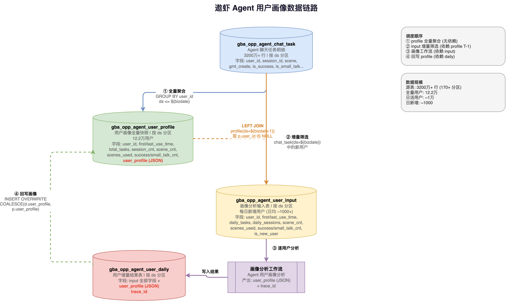

## 一、背景与目标

遨虾 Agent 是面向跨境电商卖家的 AI 选品助手，提供以图搜款、新品发现、商品改进、找供应商等多场景服务。截至 2026-04-07，平台累计 **12.2 万注册用户**，产生 **3200 万+** 条聊天任务记录。

我们面临三个问题：

1. **缺乏用户视图** — 行为数据散落在 `gba_opp_agent_chat_task` 明细表中，无法直接回答"这个用户是谁、用了什么、用得怎么样"
2. **无法识别新用户** — 每天新增约 1000 名用户，缺少高效的增量识别机制来触发画像分析
3. **画像无处安放** — Agent 工作流产出的企业画像（行业、规模、采购偏好、风险评估）没有统一的存储和更新机制

**目标**：构建一套 **全量快照 + 每日增量** 的用户画像数据链路，支撑用户分层运营、画像分析和业务洞察。

---

## 二、整体架构



### 2.1 底表与资源

| 资源 | 链接 |
|------|------|
| 全量用户画像表 `gba_opp_agent_user_profile` | [DMC 表详情](https://dw.alibaba-inc.com/dmc/odps-table/odps.cbu_op_platform.gba_opp_agent_user_profile/detail/partition) |
| 用户画像增量表 `gba_opp_agent_user_daily` | [DMC 表详情](https://dw.alibaba-inc.com/dmc/odps-table/odps.cbu_op_platform.gba_opp_agent_user_daily/detail/partition) |
| 画像分析工作流 | [源神工作流](https://1688bot.alibaba-inc.com/#/agent/workflow?code=user_analysis_workflow&id=9041023) |

### 2.2 四张表，各司其职

| 表名 | 类型 | 说明 |
|------|------|------|
| `gba_opp_agent_chat_task` | 源表 | Agent 聊天任务明细，按 ds 分区，3200 万+ 行 |
| `gba_opp_agent_user_profile` | 全量快照 | 截至当日的累计用户画像 + 画像 JSON |
| `gba_opp_agent_user_input` | 工作流输入 | 当日新增用户，触发画像分析工作流 |
| `gba_opp_agent_user_daily` | 增量结果 | 工作流产出，含 user_profile + trace_id |

### 2.3 调度链路

```
chat_task(ds=${bizdate})
    │
    │  ① 全量聚合 (GROUP BY user_id, ds <= ${bizdate})
    ▼
profile(ds=${bizdate})                    ← ④ 回写 user_profile
    │                                           ↑
    │  ② 增量筛选                                │
    │  LEFT JOIN profile(ds=${bizdate-1})         │
    │  取 p.user_id IS NULL                      │
    ▼                                           │
input(ds=${bizdate})                            │
    │                                           │
    │  ③ 画像分析工作流（源神）                   │
    ▼                                           │
daily(ds=${bizdate}) ───────────────────────────┘
```

**调度依赖**：
- ① 和 ② **可并行执行**（② 依赖的是 T-1 分区，不是当天的）
- ③ 依赖 ②，④ 依赖 ③

---

## 三、表结构设计

### 3.1 源表 `gba_opp_agent_chat_task`

```sql
-- 已有表，关键字段：
-- user_id, session_id, scene, gmt_create, is_success, is_small_talk, ext_info, query
-- 分区：ds (yyyymmdd)  |  数据量：3200 万+ 行，170+ 分区
```

### 3.2 全量快照表 `gba_opp_agent_user_profile`

```sql
CREATE TABLE cbu_op_platform.gba_opp_agent_user_profile (
  user_id         STRING COMMENT '用户ID',
  first_use_time  STRING COMMENT '首次使用时间',
  last_use_time   STRING COMMENT '最后使用时间',
  total_tasks     BIGINT COMMENT '总任务数',
  session_cnt     BIGINT COMMENT '会话数',
  scene_cnt       BIGINT COMMENT '使用场景数',
  scenes_used     STRING COMMENT '使用过的场景列表',
  success_cnt     BIGINT COMMENT '成功任务数',
  small_talk_cnt  BIGINT COMMENT '闲聊次数',
  user_profile    STRING COMMENT '用户画像JSON'
)
PARTITIONED BY (ds STRING)
LIFECYCLE 365;
```

### 3.3 工作流输入表 `gba_opp_agent_user_input`

```sql
CREATE TABLE cbu_op_platform.gba_opp_agent_user_input (
  user_id         STRING COMMENT '待分析用户ID',
  first_use_time  STRING,
  last_use_time   STRING,
  daily_tasks     BIGINT,
  daily_sessions  BIGINT,
  scene_cnt       BIGINT,
  scenes_used     STRING,
  success_cnt     BIGINT,
  small_talk_cnt  BIGINT,
  is_new_user     BIGINT COMMENT '是否新用户(1/0)'
)
PARTITIONED BY (ds STRING)
LIFECYCLE 365;
```

### 3.4 增量结果表 `gba_opp_agent_user_daily`

```sql
CREATE TABLE cbu_op_platform.gba_opp_agent_user_daily (
  -- 与 input 表相同的字段 +
  user_profile    STRING COMMENT '用户画像JSON',
  trace_id        STRING COMMENT '链路追踪ID'
)
PARTITIONED BY (ds STRING)
LIFECYCLE 365;
```

---

## 四、各节点 SQL 详解

### 节点 ①：全量快照产出

直接从源表全量聚合，按 user_id 汇总所有历史数据：

```sql
SET odps.sql.allow.fullscan=true;

INSERT OVERWRITE TABLE cbu_op_platform.gba_opp_agent_user_profile
  PARTITION (ds = '${bizdate}')
SELECT
  user_id,
  MIN(gmt_create)              AS first_use_time,
  MAX(gmt_create)              AS last_use_time,
  COUNT(*)                     AS total_tasks,
  COUNT(DISTINCT session_id)   AS session_cnt,
  COUNT(DISTINCT scene)        AS scene_cnt,
  CONCAT_WS(',', COLLECT_SET(scene)) AS scenes_used,
  SUM(CASE WHEN is_success = 'Y' THEN 1 ELSE 0 END)    AS success_cnt,
  SUM(CASE WHEN is_small_talk = 'Y' THEN 1 ELSE 0 END) AS small_talk_cnt,
  NULL AS user_profile
FROM cbu_op_platform.gba_opp_agent_chat_task
WHERE env = 'PROD' AND ds <= '${bizdate}'
GROUP BY user_id;
```

### 节点 ②：增量用户筛选

**核心逻辑**：当日活跃用户 LEFT JOIN 前一天的全量快照，匹配不到的就是新用户。

```sql
INSERT OVERWRITE TABLE cbu_op_platform.gba_opp_agent_user_input
  PARTITION (ds = '${bizdate}')
SELECT
  t.user_id,
  MIN(t.gmt_create)              AS first_use_time,
  MAX(t.gmt_create)              AS last_use_time,
  COUNT(*)                       AS daily_tasks,
  COUNT(DISTINCT t.session_id)   AS daily_sessions,
  COUNT(DISTINCT t.scene)        AS scene_cnt,
  CONCAT_WS(',', COLLECT_SET(t.scene)) AS scenes_used,
  SUM(CASE WHEN t.is_success = 'Y' THEN 1 ELSE 0 END)    AS success_cnt,
  SUM(CASE WHEN t.is_small_talk = 'Y' THEN 1 ELSE 0 END) AS small_talk_cnt,
  1 AS is_new_user
FROM cbu_op_platform.gba_opp_agent_chat_task t
LEFT JOIN cbu_op_platform.gba_opp_agent_user_profile p
  ON t.user_id = p.user_id
  AND p.ds = '${bizdate-1}'     -- 关键：关联前一天
WHERE t.env = 'PROD'
  AND t.ds = '${bizdate}'
  AND p.user_id IS NULL          -- 前一天不存在 = 新用户
GROUP BY t.user_id;
```

> **踩坑记录**：最初写的是 `p.ds = '${bizdate}'`（当天），结果永远筛不出新用户——因为当天的 profile 已经包含了当天的活跃用户。必须用 T-1。

### 节点 ③：画像分析工作流

非 SQL 节点，由[源神工作流](https://1688bot.alibaba-inc.com/#/agent/workflow?code=user_analysis_workflow&id=9041023)读取 input 表，逐用户分析后写入 daily 表：

```
input(ds=${bizdate}) → Agent 画像分析 → daily(ds=${bizdate})
```

产出的 `user_profile` JSON 结构：

```json
{
  "企业名称": "松桃新力复合材料科技有限公司",
  "所属行业": "高性能复合材料制造",
  "所在地域": "贵州省铜仁市",
  "企业规模": "微型企业",
  "商业模式类型": "OBM+OEM混合模式",
  "主营业务": "碳纤维汽车配件、玻璃钢护栏...",
  "生命周期阶段": "成长期向稳定期过渡"
}
```

### 节点 ④：画像回写全量表

画像工作流完成后，将 daily 中的 `user_profile` 合并回 profile 表。由于 ODPS 非 Transactional 表不支持 UPDATE（已有表也无法 ALTER 为 Transactional），使用 INSERT OVERWRITE 重写分区：

```sql
INSERT OVERWRITE TABLE cbu_op_platform.gba_opp_agent_user_profile
  PARTITION (ds = '${bizdate}')
SELECT
  p.user_id,
  p.first_use_time,
  p.last_use_time,
  p.total_tasks,
  p.session_cnt,
  p.scene_cnt,
  p.scenes_used,
  p.success_cnt,
  p.small_talk_cnt,
  COALESCE(d.user_profile, p.user_profile) AS user_profile
FROM cbu_op_platform.gba_opp_agent_user_profile p
LEFT JOIN cbu_op_platform.gba_opp_agent_user_daily d
  ON p.user_id = d.user_id AND d.ds = '${bizdate}'
WHERE p.ds = '${bizdate}';
```

`COALESCE` 保证：新用户写入画像，老用户保留已有画像。

---

## 五、画像全景分析

基于全量表和增量表的首次跑数，我们得到了 12.2 万用户的全景画像。以下是六个核心维度的分析结论。

### 5.1 用户规模与增长

| 指标 | 数值 | 说明 |
|------|------|------|
| 总用户量 | **122,031** | 截至 2026-04-07 的去重用户数 |
| DAU 趋势 | 140 → 15,945 | 从 2025-10 上线至今持续增长 |
| 每日新增用户 | ~1,000 | `is_new_user=1` 统计 |
| 用户增长率 | — | 可通过全量表跨分区对比计算 |

### 5.2 用户活跃度分层

| 层级 | 用户数 | 占比 | 平均场景数 |
|------|--------|------|-----------|
| S-超重度（10,000+ 次） | 98 | 0.08% | 3.7 |
| A-重度（1,000+ 次） | 3,270 | 2.7% | 3.0 |
| B-中度（100+ 次） | 23,862 | 19.6% | 1.9 |
| C-轻度（10+ 次） | 69,365 | 56.8% | 1.1 |
| D-尝鲜（< 10 次） | 25,436 | 20.8% | 1.0 |

> **洞察**：56.8% 的用户属于轻度使用，20.8% 仅尝鲜即离开。核心重度用户（S+A 层）不足 3%，却贡献了高达 69% 的任务量 — 典型的"二八效应"在此呈现为"三七倒置"。

### 5.3 用户生命周期

| 活跃周期 | 用户数 | 占比 |
|----------|--------|------|
| 仅用 1 天 | 89,207 | **73.1%** |
| 2 - 7 天 | 14,708 | 12.1% |
| 8 - 30 天 | 12,103 | 9.9% |
| 1 - 3 个月 | 4,655 | 3.8% |
| 3 个月以上 | 1,358 | 1.1% |

> **洞察**：73% 的用户在首日后即流失，用户留存是当前最核心、最紧迫的挑战。能够坚持使用超过 30 天的用户仅占约 5%，长期忠实用户的培育空间巨大。

### 5.4 场景渗透率

| 场景 | 用户数 | 渗透率 |
|------|--------|--------|
| 以图搜款 `general_image_search` | 82,572 | **67.7%** |
| 算法推荐 `algo` | 34,730 | 28.5% |
| 找供应商 `find_provider` | 22,478 | 18.4% |
| 新品发现 `new_product_discovery` | 10,560 | 8.7% |
| 商品改进 `product_improvement` | 2,042 | **1.7%** |
| 市场迁移 `market_migration` | 999 | **0.8%** |

> **洞察**：以图搜款是绝对的流量入口，覆盖近七成用户。然而，新品发现、商品改进、市场迁移等高价值深度场景渗透率极低（均不足 9%），存在显著的价值挖掘空白。

### 5.5 场景组合与交叉分析

- **单场景依赖严重**：高达 71,136 名用户仅使用"以图搜款"一个场景，占比超过 58%，说明跨场景引导机制严重不足
- **多场景用户质量更高**：使用过 2 个及以上场景的用户，其留存率和活跃度均显著优于单场景用户，印证了场景广度与用户粘性正相关
- **路径分析价值**：各场景之间的转化路径具备可分析条件，可进一步挖掘高转化率的"黄金路径"，用于产品引导优化

### 5.6 任务成功率

| 成功率区间 | 用户数 | 占比 |
|-----------|--------|------|
| 95% 以上 | 105,041 | 86.1% |
| 80% - 95% | 4,353 | 3.6% |
| 50% - 80% | 4,943 | 4.1% |
| 低于 50% | 7,694 | **6.3%** |

> **洞察**：整体任务成功率表现良好，86.1% 的用户成功率在 95% 以上。但仍有 6.3%（约 7,694 名用户）成功率低于 50%，需重点排查：是特定场景的系统性问题，还是特定用户群体的使用姿势问题，并针对性制定干预策略。

### 5.7 每日新增用户趋势

| 日期 | 新增用户数 |
|------|-----------|
| 20260402 | 1,969 |
| 20260403 | 1,696 |
| 20260404 | 869 |
| 20260405 | 688 |
| 20260406 | 1,111 |
| 20260407 | 1,809 |

> 周末（0404-0405）新增明显下降，工作日回升，符合 B2B 平台的典型使用规律。

---

## 六、关键设计决策

### 6.1 为什么全量表用每日快照？

- 可追踪用户画像的历史变化（如场景数从 1 增长到 3）
- 支持跨日对比分析（周环比 / 月环比）
- 避免非 Transactional 表的 UPDATE 限制

### 6.2 为什么增量判断用 T-1 而非 T？

- profile 当天分区包含截至当天的所有用户，与当日 chat_task 的活跃用户完全重叠
- 关联前一天分区才能发现"今天首次出现"的用户
- 调度上 input 和 profile 可以并行执行（input 依赖的是 T-1 分区，不是当天）

### 6.3 为什么 input 表独立于 daily 表？

- **职责分离**：input 是纯输入（行为数据），daily 是输出（含画像结果 + trace_id）
- **解耦**：input 产出不依赖画像工作流，可提前准备
- **重跑友好**：工作流失败时只需重跑 ③→④，不影响 ① 和 ②

### 6.4 为什么回写用 INSERT OVERWRITE？

实测发现 ODPS 已有数据的表无法 `ALTER TABLE SET TBLPROPERTIES ('transactional' = 'true')`，因此无法使用 UPDATE / MERGE INTO。INSERT OVERWRITE 重写当天分区（12 万行 < 1 分钟），简单可靠。

---

## 七、性能与后续优化

### 7.1 当前耗时

| 节点 | 读取量 | 耗时 |
|------|--------|------|
| ① 全量聚合 | ~3000 万行 | 2-3 分钟 |
| ② 增量筛选 | ~5 万 + 12 万行 | < 1 分钟 |
| ④ 画像回写 | 12 万 + ~1000 行 | < 1 分钟 |

### 7.2 演进方向

1. **全量表增量 merge** — 源表到亿级时，节点 ① 改为 `profile(T-1) + chat_task(T)` 增量合并，避免全表扫描
2. **画像字段拆列** — 将 `user_profile` JSON 中的高频查询字段（行业、地域、规模）拆为独立列，支持高效 WHERE / GROUP BY
3. **Transactional Table** — 新建 Transactional 表并迁移数据，回写逻辑简化为 MERGE INTO
4. **DataWorks 调度** — 配置分区依赖和报警机制，替代本地 crontab 脚本

---

*架构图源文件：[gba-opp-agent-user-profile-pipeline.drawio](./gba-opp-agent-user-profile-pipeline.drawio)*
